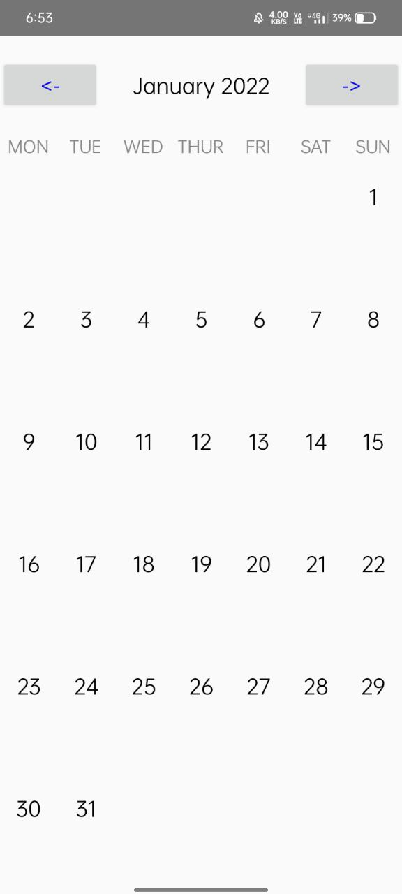

# Simple Calendar #
----------------------------------------------------
Simple Calendar is an just another open-source Android Calendar application written in java. 

## Features ##
* Minimal & Clean
* Fullfilles needs of a basic calendar

<p align="center">
  
</p>

## Building Simple Calendar ##
```
./gradlew :app:assembleRelease
```

## Credits ##
* Simple Calendar is licensed and distributed under **The GNU General Public License v3.0**
* This Project is Entirely Developed by 
  - [Aryan Sinha](https://github.com/techyminati)

## Note ##
* Pull Requests are Welcome, You can use this as your base app, Just provide proper credits. Thanks!
